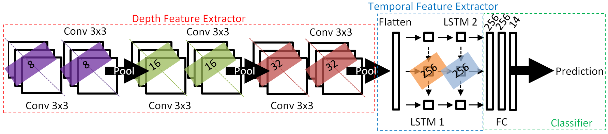

# CNN+RNN Depth and Skeleton based Dynamic Hand Gesture Recognition

Script provided is in relation with the following paper:

- K. Lai and S. N. Yanushkevich, [CNN+RNN Depth and Skeleton based Dynamic Hand Gesture Recognition](https://ieeexplore.ieee.org/document/8545718), in IEEE International Conference on Pattern Recognition, Beijing, China, August 2018, pp.3451-3456.

Architure used in the paper is as follows:




## Dataset
The experiment in this paper is based on the [DHG-14/28 Dataset](http://www-rech.telecom-lille.fr/DHGdataset/). A description of the dataset can be found in:

*Q. De Schmidt, H. Wannous, and J. Vandeboore, “Dynamic Hand Gesture Recognition using Skeleton-based Features,” CVPRW, 2016*

## Setup
Libraries:
- numpy 1.18.1
- keras 2.2.4
- tensorflow 1.13.1

## Usage
To run with default parameters for multi-class emotion recognition:
```
python3 cnnlstm.py
```
